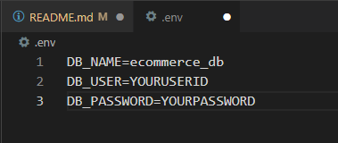
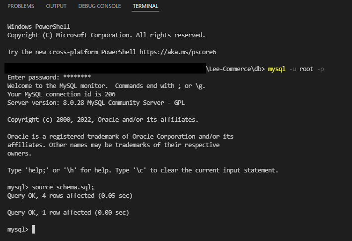
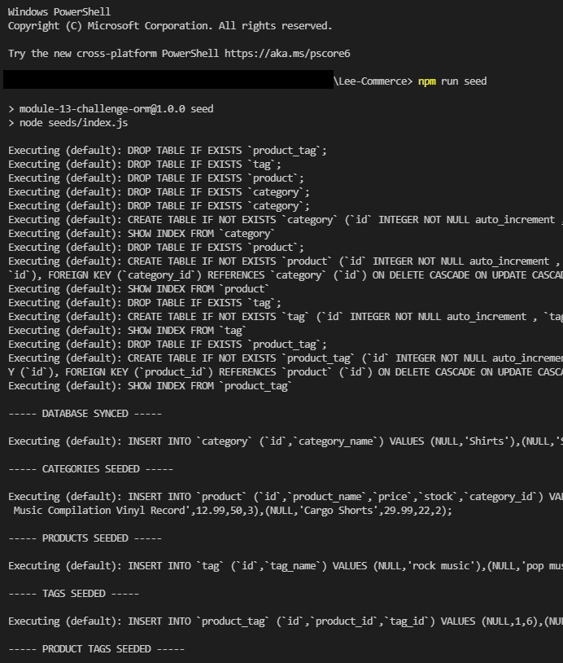
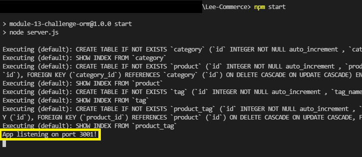
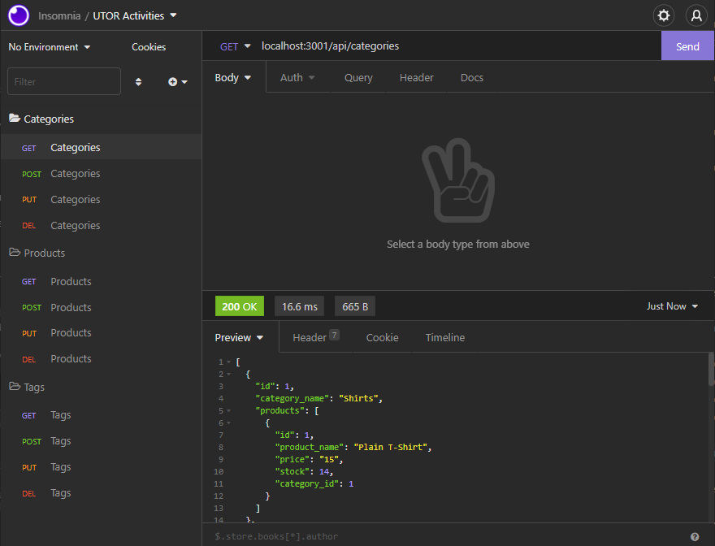

# Lee-Commerce

## License
  [](https://opensource.org/licenses/MIT)
  [](https://docs.npmjs.com/policies/npm-license)

## Table of Contents

[Description](#description)

[Installation](#installation)

[Usage](#usage)

[Test](#test)

[Screenshot](#screenshot)

[Demo](#demo)

[Contributors](#contributors)

## Description

This is a back-end application for Internet Retail (AKA e-commerce) that demostrates the fundamental architecture of e-commerce platforms. Users are able to create/post/update products and create/post/update categories and tags for each products. 

This application was made using JavaScript, MySQL, Node JS, Express.JS API and NPM Packages. 

## Installation

  For Installation, you are required the following:
  - Node JS 
  - MySQL 
  - Insomnia (to handle post/put requests for the database)
  
  Additional packages required are: 
  - Node Packet Manager(NPM):
    - NPM [dotenv](https://www.npmjs.com/package/dotenv)
    - NPM [express](https://www.npmjs.com/package/express)
    - NPM [mySQL2](https://www.npmjs.com/package/mysql2)
    - NPM [require](https://www.npmjs.com/package/require)
    - NPM [sequelize](https://www.npmjs.com/package/sequelize)

  You can install the above required packages by entering following on the terminal/node:
  ```
    npm install
  ```
## Usage
This application is not deployed currently as it does not have a front end. However, you are still able to use this application by cloning or forking my repository and running the files on your IDE, Terminal, Console, Node or Powershell.

1. You will be required to create your .env file as per the .env.EXAMPLE file. 

    (Default value for USER is usually ROOT for mySQL.) 

    

2. Then you will be required to run the schema.sql in mySQL console. 
This will create the databse "ecommerce_db". 
    ```
    mySQL -u root -p ("ENTER YOUR PASSWORD")

    source schema.sql;
    ```

3. Then you will be required to seed your data into the database by running the following command on a separate node where your server.js is located. 
    ```
    npm run seed       or        node ./seeds/index.js
    ```
4. Then in the same console, you may run the server.js file to start using your application. 
    ```
    npm start          or        node server.js
    ```

5. Confirm the server as per the log on your console, and use the route as per screenshot4 to begin manipulating the database! 

    ```
    App listening on port 3001!
    ```

## Test
No testing was done for this project. 

However, please feel free to add the feature to contribute to this project or contact me for more details!

## Screenshot






## Demo 
Demo Video is divided into 2 Parts: 

Demo: Visual Studio Guide [here](https://youtu.be/qgiMm5A8d34)

Demo: Insomnia Guide [here](https://youtu.be/fRAtjuBpgtM)
## Contribution

    Joe Lee 2022

    Got any questions or want to contribute to this project? 

Contact me via: 

  - [Jollypong](https//:github.com/Jollypong) 

  - Email: joeleegc@gmail.com

## 